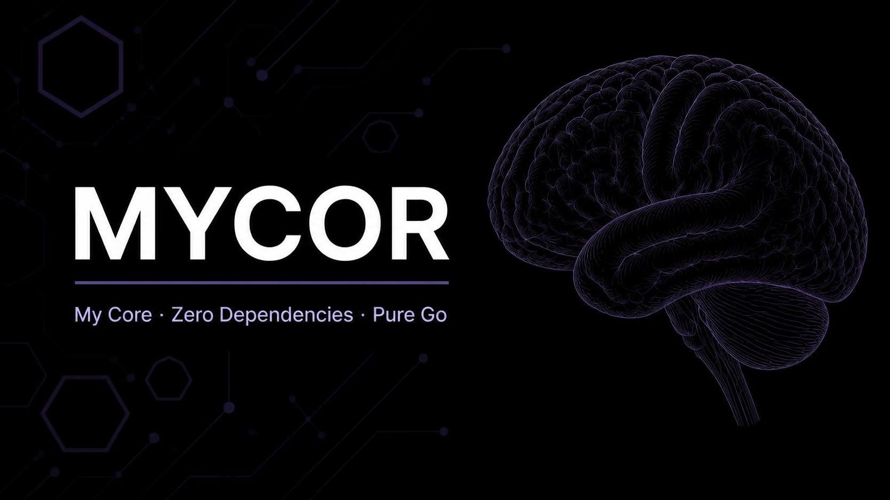

  

# 🧠 MYCOR — v6.0

> **My Core. Zero Dependencies. Pure Go. Web UI in one .exe. Top-K / Top-P. Adaptive N-gram. Sparse weights.**

**MYCOR** is a completely "empty" local language model written in pure **Go 1.27.1**, built from scratch without any third-party frameworks, Python, or CGO. It ships as a single self-contained executable that opens a local web interface in your default browser.

In an era of terabyte-scale corporate black boxes, **MYCOR** returns control to the developer. It is a digital sandbox and canvas whose character you shape entirely yourself.

---

## 🎯 Project Philosophy

On first launch, MYCOR is a "blank slate" (Tabula Rasa). To any of your requests, the model will output chaotic nonsense. It has no pre-loaded knowledge, censorship, or bias.

**It learns only from you.** By chatting with it and correcting its answers, you literally build its "brain" (a dynamic weight matrix of N-grams) from scratch. Grow your own, albeit simple, but truly *personal* neural network right on your local hardware.

---

## 🆕 What's new in v6.0

v6.0 is an architecture and correctness release. The headline change is that the
server is no longer single-threaded behind one global mutex.

### Concurrency

- 🔓 **No global request mutex.** Model state moved from package-level variables
  into a `Brain` value guarded by a `sync.RWMutex`. The web layer no longer
  serialises every request behind a single lock.
- 💬 **Chat during import.** A long bulk import used to block every other
  request until it finished. Training now holds its own mutex for the duration
  but takes the state lock one token step at a time, so the chat stays
  responsive. `TestChatRespondsDuringImport` guards this.
- 🛑 **Graceful shutdown.** `Ctrl+C` or closing the console drains in-flight
  requests and flushes the brain instead of killing the process mid-write.

### Performance

- 🧹 **Sparse weights.** Weight vectors are `map[int]float64` keyed by
  vocabulary index. Adding a word no longer rewrites every context vector, which
  made vocabulary growth quadratic; it is now O(1).
- 💾 **Journal-based undo.** Undo records only the contexts a training step
  actually touched instead of copying the whole model on every call.
- ⚡ **Bounded Top-K / Top-P.** Sampling selects the top K with a heap and then
  narrows to the nucleus, instead of sorting the entire vocabulary per token.
- 🕒 **Debounced saving.** Training marks the state dirty and a background
  saver writes it; it no longer serialises the entire brain on every keystroke.
  `/api/save` forces an immediate write.

### Correctness and safety

- 🐛 **`<unk>` handling fixed.** A brain file that stored `<unk>` somewhere other
  than the front used to load with a duplicate token and a corrupted
  word→index map. It is now normalised to exactly one `<unk>` at index 0.
- 📜 **Explicit file format.** Brains are written with a `MYCOR-BRAIN` magic
  header instead of relying on a first-byte sniff, which mis-read JSON files
  starting with whitespace or a BOM.
- 🎲 **Seeded randomness.** Sampling and weight init use a seeded RNG instead
  of the global `math/rand`, which produced identical output across runs.
- 🚧 **Request limits.** Request bodies are size-capped.
- 🔒 **Import sandboxing.** `/api/import` accepted any path the client sent,
  letting a request that reached the server read arbitrary files. Paths are now
  validated against an allow-list of directories and must be `.txt`.
- ❌ **No swallowed errors.** Failed saves are reported to the client instead
  of discarded.

### Frontend

- 🌐 **Client-side i18n.** The UI translates fully in both languages.
- 🐢 **Debounced sliders.** Dragging a slider sends one request, not dozens.
- 🧹 **Reset clears everything.** Chat, teacher panel and sliders are reset
  along with the model.
- ↩️ **Undo re-syncs history.** The transcript is re-read from the server.
- 🔁 **Session restore.** Reloading the page restores the conversation.

### Kept from v5.0

- Embedded web UI served from `internal/web/static`, compiled in with `//go:embed`.
- Live sliders for temperature, Top-K, Top-P, learning rate, momentum, context
  size and thinking steps.
- Adaptive N-gram context window (1 to 5 words) with dynamic backoff.
- Idle thoughts that never seed on `<unk>`.
- Unicode-aware tokenizer and arbitrarily long lines in the TXT importer.
- Brain and configuration stored in the OS user configuration directory.

---

## ✨ Key Features

- 📦 **Zero Dependencies:** Uses exclusively the Go standard library.
- 🖥️ **Single binary:** `go build` produces one `.exe` containing the engine and the UI.
- 🚀 **Adaptive N-gram context:** Window of 1 to 5 previous words.
- 🪜 **Dynamic Backoff:** Full context → masked variants → `<unk>` unigram.
- 🔝 **Top-K and Top-P sampling** on top of temperature and repetition penalty.
- 🎭 **Emoticon-aware tokenizer.**
- 🧠 **Dynamic vector vocabulary:** New words extend the weight matrix on the fly.
- 💭 **Thinking Mode:** A latent chain of thoughts before the answer (activates at ≥10 words).
- 💤 **Idle Thinking:** The AI daydreams on its own when you are away.
- 🌐 **Bilingual UI:** English / Russian, switchable at runtime.
- 💾 **Persistent memory:** Binary brain file restored on restart.
- 📖 **Batch import:** Auto-training from a text file with unlimited line length.
- 🌀 **Momentum optimizer** with L2 weight decay.
- 🛡️ **Atomic save:** Temp file + rename.
- 🔒 **Strict validation:** Duplicate words, weight length, and file integrity checked on load.
- 🧪 **Test coverage:** Engine, importer, thinking mode, dynamic backoff, idle thinking, configuration reset, gob round-trip, JSON fallback.

---

## 🚀 Quick Start

### Option A — Download the release

Grab the `.exe` for your platform from GitHub Releases, put it in any folder, run it. The browser opens at `http://127.0.0.1:XXXXX/`.

### Option B — Build from source

    git clone https://github.com/datekt/MYCOR.git
    cd MYCOR

On Windows:

    .\scripts\build.ps1

On Linux/macOS:

    ./scripts/build.sh

Or directly:

    go build -trimpath -ldflags="-s -w" -o bin/mycor.exe ./cmd/mycor

### First conversation

1. The browser tab opens. The sidebar shows `Vocabulary: 1`, `Thinking: OFF`.
2. Type a phrase in the input box and press Enter. The model will answer with something chaotic — it is empty.
3. In the "Teach correction" field, type the correct answer and press **Train**. Loss is printed in the chat log.
4. Repeat until the vocabulary reaches 10 words. The sidebar's `Thinking` row flips to `ON`.
5. Step away for 45 seconds. Idle thoughts start appearing in the chat.

---

## 🕹️ Interface

### Sidebar

| Control | Range | Effect |
| --- | --- | --- |
| Temperature | 0.1 – 1.5 | Softmax temperature |
| Top-K | 0 – 200 | Keep K most likely tokens (0 = off) |
| Top-P | 0 – 1.0 | Nucleus sampling threshold (0 = off) |
| Learning Rate | 0.01 – 1.0 | SGD step size |
| Momentum | 0.0 – 0.99 | EMA gradient inertia |
| Context Size | 1 – 5 | N-gram window length |

### Actions

- **Undo** — revert the last training step.
- **Reset** — erase the brain and restore all defaults.
- **Idle** — toggle idle thinking.
- **Import** — batch-train from a TXT file by path.
- **EN / RU** — switch interface language.

### HTTP API

All endpoints return JSON. The UI is a thin client over them, so you can script MYCOR from anything that speaks HTTP.

| Method | Path | Body | Returns |
| --- | --- | --- | --- |
| POST | `/api/chat` | `{"message": "..."}` | `{"reply": "...", "thoughts": "..."}` |
| POST | `/api/train` | `{"prompt": "...", "target": "..."}` | `{"loss": 0.42, "hasLoss": true}` |
| GET | `/api/stats` | — | vocabulary, parameters, config, recent contexts, brain path |
| POST | `/api/config` | any subset of config keys | `{"status": "ok"}` |
| POST | `/api/undo` | — | `{"ok": true}` |
| POST | `/api/reset` | — | `{"status": "ok"}` |
| POST | `/api/import` | `{"path": "book.txt"}` | vocabulary and parameter counts |
| POST | `/api/lang` | `{"lang": "en"}` | `{"lang": "en"}` |
| GET | `/api/history` | — | session messages |
| POST | `/api/save` | — | `{"status": "ok"}` |
| GET | `/api/idle` | — | `{"thought": "..."}` or empty |

---

## 🧠 Memory: Where the Brain Lives

The trained brain is stored in the operating system's per-user configuration directory, so the folder where you keep `mycor.exe` stays clean:

- **Windows:** `%AppData%\MYCOR\brain.gob`
- **Linux:** `~/.config/MYCOR/brain.gob`
- **macOS:** `~/Library/Application Support/MYCOR/brain.gob`

The exact path is printed in the terminal on every launch, in the line
`Brain file: ...`.

**Saved to that file and survives restart:**
- Vocabulary.
- Weight matrix.
- Optimizer state (velocity).

Runtime configuration lives beside it in `config.json` in the same directory,
so slider positions survive a restart too. Delete either file to start over.

**Reset on every launch:**
- Session dialogue history.
- Recent active contexts list.
- Last "thoughts" of the network.

**Reset only by the Reset button:**
- Runtime configuration.
- The brain file on disk (a fresh empty brain is written in its place).
- The in-memory brain.

To back up or share your trained character, copy `brain.gob` out of the folder
above. To load someone else's brain, drop their file into the same folder before
launching MYCOR — the app will pick it up on startup.

---

## 💭 How Thinking Mode Works

1. **Activation threshold:** `MinVocabThinking` (default 10).
2. **Internal generation:** The engine performs `ThinkingSteps` (default 4, configurable in the UI) sampling steps from the same weight matrix.
3. **Answer context:** The resulting thought becomes a prefix to the prompt, and the final answer is generated from the extended context.
4. **Transparency:** The thought line is shown in the chat above the answer.

---

## 🪜 How Dynamic Backoff Works

For a context window of length N, the engine tries contexts in this order:

1. The full N-gram `(w1, ..., wN)`.
2. `keepLast k` for k = N-1 down to 1: only the last k words survive, the rest become `<unk>`.
3. `keepFirst k` for k = N-1 down to 1: only the first k words survive.
4. The fully-masked `<unk> ... <unk>` context.

The first context with trained weights wins. If none exist, generation falls back to a random vocabulary pick and thinking stops early. The chain is rebuilt every step from the current vocabulary and weight state, and deduplicated.

---

## 🎭 Special Tokens for Punctuation and Emoticons

Whole emoticons are single tokens:

`:-)`, `:)`, `;-)`, `;)`, `:-D`, `:D`, `:-P`, `:P`, `:3`, `:/`, `:|`, `:'(`, `:'-(`, `:*`, `^^`, `<3`, `o_o`, `-_-`

Punctuation is split into separate tokens, both ASCII (`. , ? ! : ;`) and Unicode typography (`— – … « » “ ” ‘ ’`).

---

## 💤 How Idle Thinking Works

1. **Timer:** After each message, an inactivity timer is reset. If no request arrives for `IdleTimeoutSec` seconds (default 45), the idle endpoint produces a thought.
2. **Seed:** The most recently touched context is used. If none exists, a random word from `Vocabulary[1:]`.
3. **Daydream:** The same thinking pipeline runs and the result is appended to the chat.

Toggle at runtime with the **Idle** button.

---

## 🛠️ How It Works Under the Hood

The mathematics of MYCOR take a little over 400 lines of code in the `internal/engine/` folder.

Training uses:
- **Softmax** with numerical stabilization (max shift, uniform fallback).
- **Cross-entropy** loss.
- **SGD with momentum:** `v = m*v + (1-m)*grad; w = w*decay + lr*v`.
- **L2 weight decay.**

Generation uses:
- **Temperature**, **Top-K**, **Top-P**, **Repetition Penalty**.
- **Thinking Mode** for inner monologue.
- **Dynamic Backoff** for context descent.
- **Idle Thinking** for autonomous daydreams.

---

## 🗺️ Roadmap

- [x] v1.0 — Character-level model.
- [x] v2.0 — Word-level tokens.
- [x] v3.0 — Sliding N-gram context window.
- [x] v4.0 — Command processor, loss calculation, batch import.
- [x] v4.1 — Engine tests, fixes for undo, softmax, import, validation.
- [x] v4.2 — Momentum, weight decay, atomic save, persistent memory.
- [x] v4.3 — Thinking Mode, transparent thoughts, `<unk>` filtering.
- [x] v4.4 — Punctuation/emoticon tokens, Dynamic Backoff, Idle Thinking, bilingual UI.
- [x] v4.5 — Hardening: encapsulation, Unicode tokenizer, safe softmax, config reset.
- [x] v5.0 — Desktop edition: embedded web UI, Top-K/Top-P, adaptive N-gram, gob weights, brain in user config dir.
- [x] v6.0 — Concurrency rewrite (Brain + RWMutex, no global mutex), sparse weights, journaled undo, debounced saves, import sandboxing, graceful shutdown, client i18n.
- [ ] v6.1 (planned) — Drag-and-drop TXT import, loss chart, named brains, streaming answers.

## 📄 License

MIT. See `LICENCE`.